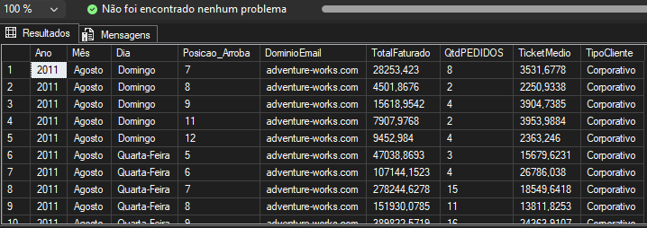

# Desafio SQL: Análise de Sazonalidade e Segmentação de Clientes - AdventureWorks

## Contexto do Desafio
A diretoria executiva e a equipa de Marketing solicitaram um relatório estratégico para identificar os padrões de consumo e o perfil dos clientes
ativos na plataforma. O objetivo é mapear a sazonalidade das vendas por períodos cronológicos e segmentar as contas com base nos domínios de e-mail cadastrados,
diferenciando o público corporativo do retalho. Esta inteligência de dados servirá para subsidiar futuras campanhas de marketing direcionadas e otimizar o planeamento financeiro.

## Solução Técnica Implementada
Para extrair as informações com máxima performance e sem redundâncias, foi construída uma consulta SQL estruturada com as seguintes premissas:

* **Tratamento Dinâmico de Strings:** Utilização combinada das funções `SUBSTRING` e `CHARINDEX` para localizar o caractere `@` e isolar o domínio dos e-mails de forma automatizada.
* **Análise de Sazonalidade Temporal:** Quebra minuciosa da data de pedido (`OrderDate`) através das funções `DATEPART` e `DATENAME`, extraindo o Ano,
* o Mês por extenso e o Dia da Semana correspondente.
* **Classificação por Regra de Negócio:** Implementação de uma estrutura condicional `CASE WHEN` para segmentar os canais.
* Contas com domínio `adventure-works.com` são classificadas como **'Corporativo'**, enquanto as demais são mapeadas como **'Varejo (Final)'**.
* **Consolidação de Indicadores Financeiros:** Aplicação de funções de agregação (`SUM` e `COUNT DISTINCT`) para gerar métricas essenciais como Faturamento Total,
* Quantidade de Pedidos Únicos e o cálculo do Ticket Médio do período.
* **Agrupamento Multi-nível:** Ordenação e consolidação rigorosa via `GROUP BY` utilizando as expressões originais de data e texto, garantindo a integridade dos dados finais.

## Código SQL
O script completo e totalmente documentado com comentários informativos linha por linha encontra-se no ficheiro `solucao_desafio.sql` deste repositório.

## Resultados Obtidos
Abaixo está o registo visual do resultado gerado pela consulta executada com absoluto sucesso no ambiente SQL Server Express, trazendo a tabela perfeitamente estruturada:

